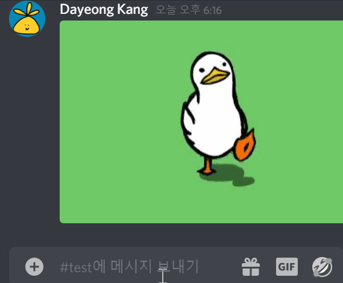

# quantum-ugly-duckling
Qiskit Hackathon Project

"One thing that traditional computer systems aren’t good at is coin flipping. They’re deterministic, which means that if you ask the same question you’ll get the same answer every time. In fact, such machines are specifically and carefully programmed to eliminate randomness in results. They do this by following rules and relying on algorithms when they compute.”
-Steve Ward, Professor of Computer Science and Engineering at MIT’s Computer Science and Artificial Intelligence Laboratory.

The aim of this project is to build a random number generator with a quantum computer and the help of the noise it is prodrucing.
Random numbers can be used in various applications like the Monte Carlo simulation for electric circuits, for procedural generation of landscape in games or for cryptography to have a save way to authenticate.

What we did:
1. Creating a Quantum Random Number Generator using just noise.
2. Testing the new QRNG and comparing with the Hadamard Random Number Generator.
3. Linking the Quantum Random Number Generator with the Qad jokes in the IBM cloud.
4. Creating a Discord API to display the Qad jokes.

To see how our quantum circuit behaves in a real devices, we also tested it there.
Comparing the up to now used Hadamard circuit to our noisy quantum circuit showed, that the randomness is comparable, in the simulation and the real device.

The QRNG in this project was used to make a Discord bot tell random Qad jokes (quantum dad jokes). These jokes are taken from the IBM cloud where the participants of the Hackathon could ad jokes.

